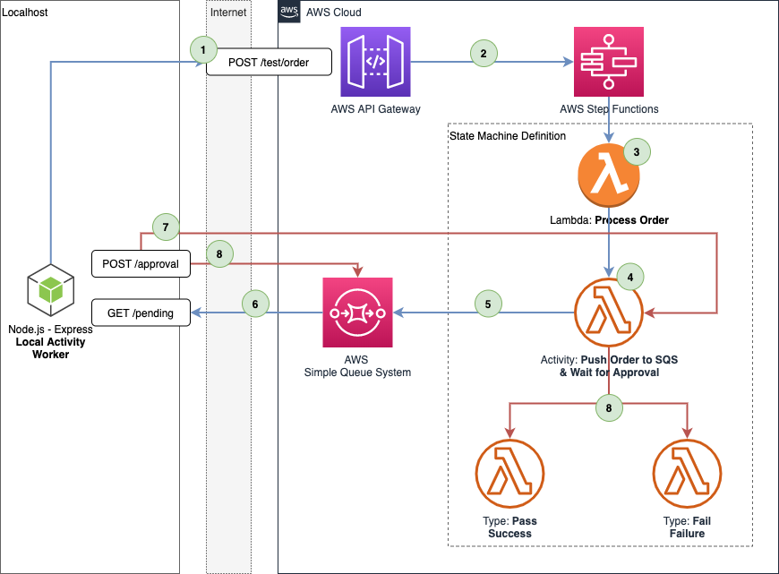

# Backup Workflow
> ⚠️ Building this stack will generate costs in your billing dashboard, use it ONLY IF you understand the consequences ⚠️

This is a step functions workflow that demonstrates how you can implement signaling (pausing and processing external input) with the help of callbacks and AWS SQS.

## Architecture



This workflow is more complex than `backup_workflow`, let's break down what's happening here:

1. Using the [AWS API Gateway](https://aws.amazon.com/api-gateway/) we create an endpoint that will receive an `HTTP POST` request on the endpoint `https://<whatever_url_we_configure>/test/order`
2. The API endpoint will kickoff the step functions workflow execution simulating a new order in the system
3. The starting point of the workflow / state machine is a [Lambda Function](https://aws.amazon.com/lambda/) that will simulate an order being processed by some backend system
4. The state machine then transitions to a task that will push a message to SQS with a `Task Token` and will pause while it waits to receive a success or fail callback
5. [SQS](https://aws.amazon.com/sqs/) will receive the message and push it to the designated queue
6. Our local [Express](https://expressjs.com/) controller app will expose a few local endpoints and when it receives an `HTTP GET` request to `http://localhost:<port>/pending` it will pull a message from SQS for processing
7. Upon calling the locally exposed endpoint `http://localhost:<port>/approval` our app will send a `SendSuccess` signal to our state machine ordering it to move ot the next step
8. We will delete that message from the queue and ased on the callback received by the state machine will move to Success (we are not handling a failure scenario)

This is not a **production ready architecture**. This is designed for educational / illustrative purposes only.

## Structure

## Build the AWS Stack

The below will prepare the AWS environment we will use with this workflow demo. It will create the necessary IAM roles, policies, step functions state machine, SQS queue and a lambda.

Don't forget to destroy the stack when you are done with it with `terraform destroy`.

```sh
# Make sure you are in the main project directory
approval_workflow/

# Build the needed artefacts and run the controller app
init.sh

# Dry-run
terraform plan \
  --var="lambda_function_payload="(pwd)"/lambda/payload.zip" \
  --var="sfn_state_machine_definition="(pwd)"/state_machine_definition.json.tpl" \
  terraform

# Build the stack
terraform apply \
  --var="lambda_function_payload="(pwd)"/lambda/payload.zip" \
  --var="sfn_state_machine_definition="(pwd)"/state_machine_definition.json.tpl" \
  terraform

# Destroy the stack
terraform destroy \
  --var="lambda_function_payload="(pwd)"/lambda/payload.zip" \
  --var="sfn_state_machine_definition="(pwd)"/state_machine_definition.json.tpl" \
  terraform

# Get output in json format
terraform output -json

# Get the value of a specific output
terraform output api_url
```

If you don't want to test the environment from the AWS console, you can use the local web interface in this repo available in `./app` to interact with the demo.

After you run `terraform apply` as per the above, you will get the following output:

```sh
Apply complete! Resources: 29 added, 0 changed, 0 destroyed.

Outputs:

api_url = https://<unique_id>.execute-api.eu-west-1.amazonaws.com/test
order_process_lambda_arn = arn:aws:lambda:eu-west-1:<account_numb>:function:PROCESS_ORDER-helped-skylark
orders_queue_sqs_url = https://sqs.eu-west-1.amazonaws.com/<account_numb>/pending_orders_queue.fifo
sfn_state_machine_arn = arn:aws:states:eu-west-1:<account_numb>:stateMachine:ApprovalWorkflowStateMachine-helped-skylark

# I removed the account numbers and replaced them with <placeholders> for privacy / security purposes
```

### Controller App

The controller app is a simple web app build with `Node.js and Express`. The app will be your interface to this workflow. 
From the web app you can simulate a new order triggering a new state machine execution and you can approve an order by fetching it from SQS and resuming the state machine.

To run the controller app, replace the environment variable values below with the values from the output above and run `npm start`. Example:

```sh
env AWS_REGION="eu-west-1" \
env QUEUE_URL="https://sqs.eu-west-1.amazonaws.com/<account_numb>/pending_orders_queue" \
env API_URL="https://<unique_id>.execute-api.eu-west-1.amazonaws.com/test/order" \
env SFN_ARN="arn:aws:states:eu-west-1:<account_numb>:stateMachine:ApprovalWorkflowStateMachine-helped-skylark" \
npm start
```

### Additional variables to consider

The following arguments are supported:

- `aws_profile` : (string) AWS profile you'd like to use. Leave empty for default value
- `aws_region` : (string) AWS region you'd like to use. Default: eu-west-1
- `credentials_path` : (string) Path where AWS credentials are stored. Default: ~/.aws/credentials

**Example:**
```sh
terraform apply \
  --var="lambda_function_payload="(pwd)"/lambda/payload.zip" \
  --var="sfn_state_machine_definition="(pwd)"/state_machine_definition.json.tpl" \
  --var="aws_profile=personal" \
  --var="aws_region=eu-west-2" \
  --var="credentials_path=~/.aws/non_default_credentials_file" \
  terraform
```

⚠️ Make sure to pass the exact same variables when you want to destroy the stack.