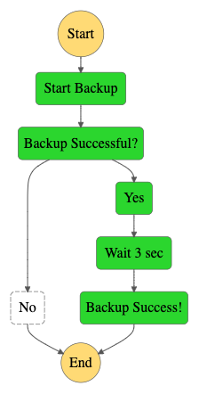
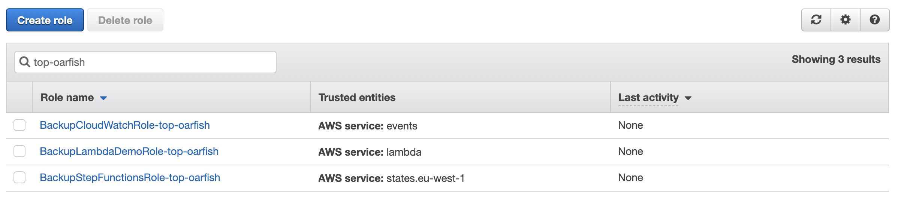
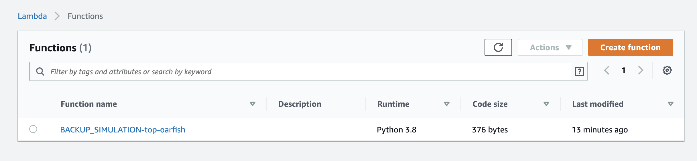
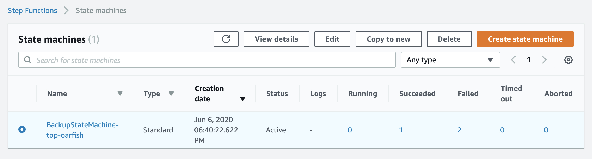
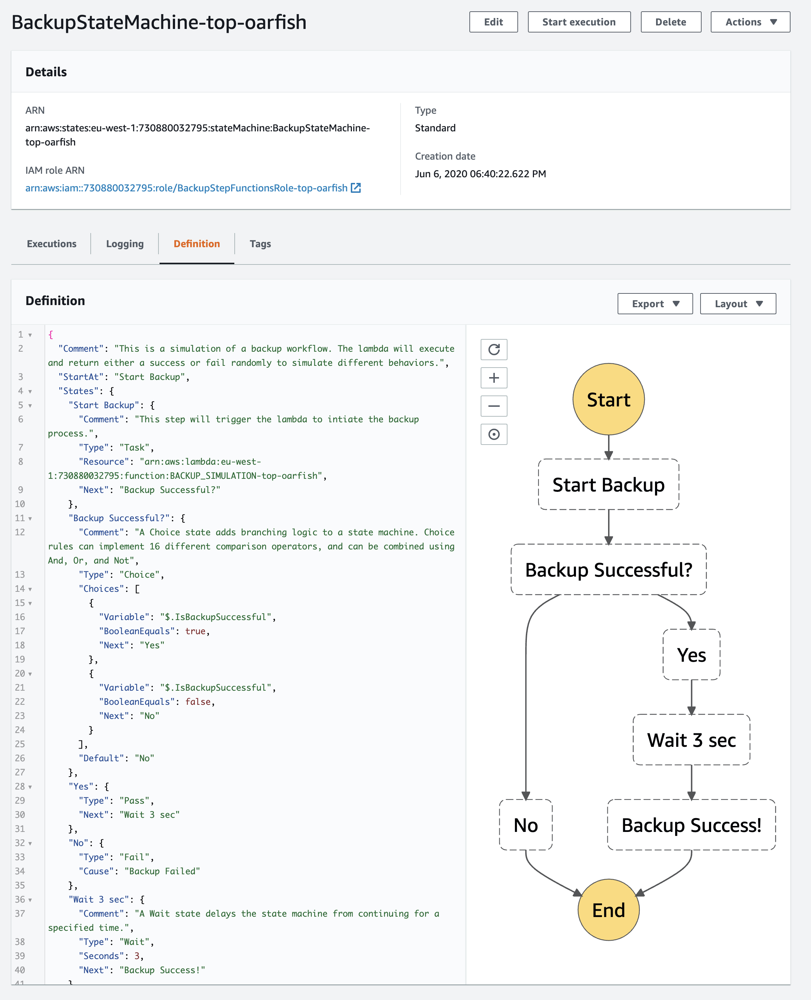
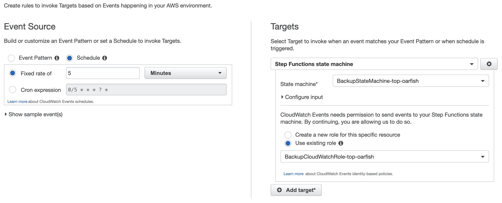
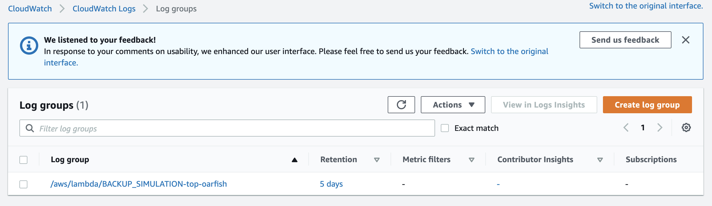

# Backup Workflow
> ⚠️ Building this stack will generate cost in your billing dashboard, use it ONLY IF you understand the consequences ⚠️

Simulates a scheduled backup workflow. An event rule is created in CloudWatch that triggers the exectuion of the Step Function's state machine every 5 minutes. In tern the state machine will invoke the backup simulation lambda.

This workflow does not execute an actual backup, it's simply a demonstration of the basic features of Step Functions.



## Structure

The following is the list of the important folders / files in this project that you should pay attention to:
```
.
├── README.md
├── init.sh
├── lambda
│   └── function.py
├── state_machine_definition.json.tpl
├── terraform
│   ├── main.tf
│   ├── outputs.tf
    └── variables.tf
```

- `lambda/` : Folder containg the payload of the backup lambda function
- `terraform/` : Folder containing the terraform templates
- `init.sh` : Script that will build the needed artefacts and prepare the terraform environment
- `state_machine_definition.json.tpl` : The definition of the step function's state machine. It's been re-written as a terraform template to allow the injection of the lambda's arn in it

## Run

```sh
# Run the build script to generate the lambda function payload
init.sh

# Dry-run
terraform plan \
  --var="lambda_function_payload="(pwd)"/lambda/payload.zip" \
  --var="sfn_state_machine_definition="(pwd)"/state_machine_definition.json.tpl" \
  terraform

# Build the stack
terraform apply \
  --var="lambda_function_payload="(pwd)"/lambda/payload.zip" \
  --var="sfn_state_machine_definition="(pwd)"/state_machine_definition.json.tpl" \
  terraform

# Destroy the stack
terraform destroy \
  --var="lambda_function_payload="(pwd)"/lambda/payload.zip" \
  --var="sfn_state_machine_definition="(pwd)"/state_machine_definition.json.tpl" \
  terraform
```

### Additional variables to consider

The following arguments are supported:

- `aws_profile` : (string) AWS profile you'd like to use. Leave empty for default value
- `aws_region` : (string) AWS region you'd like to use. Default: eu-west-1
- `credentials_path` : (string) Path where AWS credentials are stored. Default: ~/.aws/credentials

**Example:**
```
terraform apply \
  --var="lambda_function_payload="(pwd)"/lambda/payload.zip" \
  --var="sfn_state_machine_definition="(pwd)"/state_machine_definition.json.tpl" \
  --var="aws_profile=personal" \
  --var="aws_region=eu-west-2" \
  --var="credentials_path=~/.aws/non_default_credentials_file" \
  terraform
```

⚠️ Make sure to pass the exact same variables when you want to destroy the stack.

## AWS Assets Created with Terraform

### IAM Roles and Policies



### Backup Simulation Lambda Function



### Step Functions State Machine




### CloudWatch Event Rule



### CloudWatch Log Group

